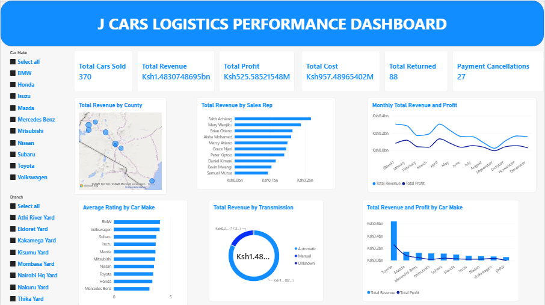
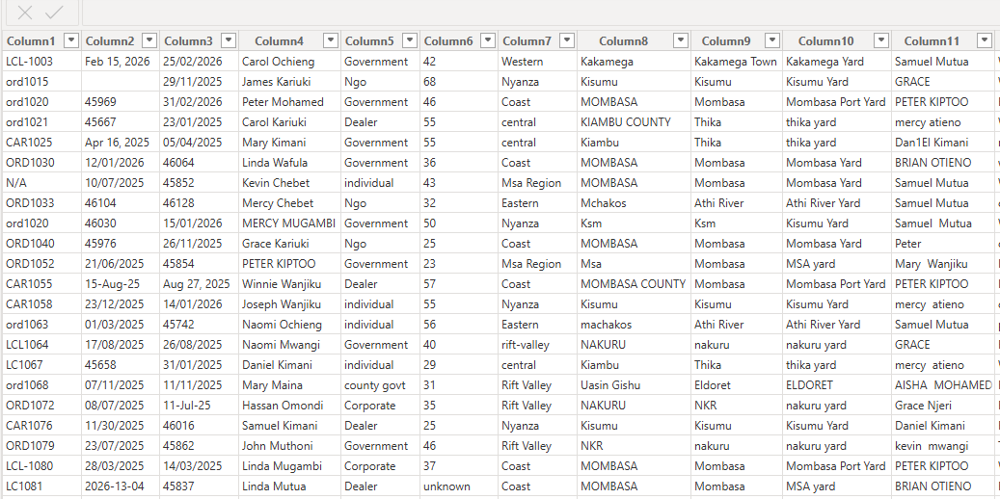
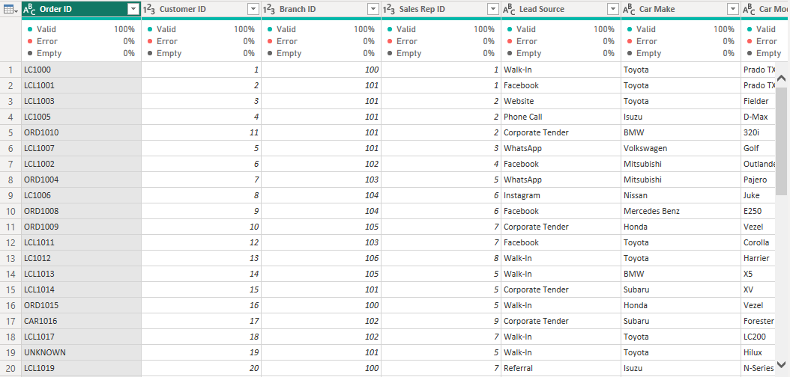
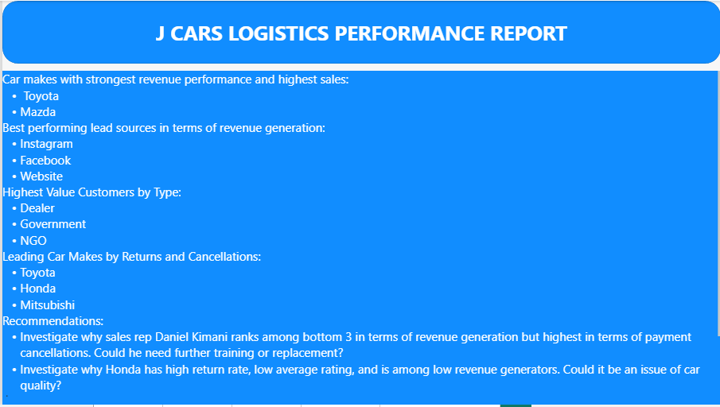

# Power_BI_Car_Sales_Business_Analysis
J Cars Logistics is a car sales business. The business serves a diverse range of clients including, individuals, corporates, and even the government. Jcars has 8 branches stocking different car makes. The business has 10 sales representatives tasked with driving sales across the 8 branches while leveraging different lead sources such as social media. For this project, the goal was to use Power BI to analyze data and create diverse KPIs and visuals that help the business gain a deeper understanding of how it is performing. The analysis was a gradual process that yielded meaningful insights for the business. 
## Dashboard Preview

## Project Overview
A raw csv file containing data pertaining to JCars was provided. Below is a snippet of the raw data.

The data was cleaned and prepared as shown in the snippet below:

Cleaning was done using Power Query. Additional data preparation steps entailed creation of calculated measures and calculated columns using DAX. Lastly, the data was analyzed and visualized as shown [here](JCars-Analysis.pbix). 
## Dashboard Features
- KPIs
    - Total Cars Sold
    - Total Revenue
    - Total Profit
    - Total Cost
    - Total Units Returned
    - Number of Cancelled Payments
- Total Revenue by County
- Total Revenue by Sales Rep
- Monthly Total Revenue and Profit
- Average Rating by Car Make
- Total Revenue by Transmission Type
- Total Revenue and Profit by Car Make
- Slicers for
  - Car Make
  - Branch
## Business Insights

## Files Included
|File|Description|
|------|-----------|
|JCars-Analysis.pbix|Power BI file containing a fact table, dimension tables, visuals, dashboard, and report|
|Raw-Data-Snippet.PNG|A snippet of originally provided data in its rawest form|
|Clean-Data-Snippet.PNG|A snippet of the data after undergoing cleaning and preparation|
|Dashboard.PNG|Image showing business performance|
|Report.PNG|Image showing insights derived from the analysis|
## How to Download and Use
1. Download the [Power BI file](JCars-Analysis.pbix).
2. Open it using Power BI.
3. Go to the Dashboard page.
4. Use Car Make and Branch slicers to explore results.
## Tools Used
- Microsoft Power BI
- Data Analysis Expressions (DAX)
- Charts
- Slicers
  
